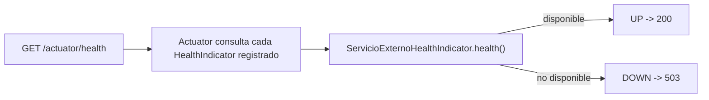
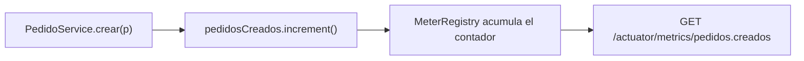

# Módulo 7: Observabilidad con Actuator

Cada tema se practica por separado con su propia repetición progresiva y su propio reto de memoria, verificado con `MockMvc` real contra los endpoints reales de Actuator, para que "health responde UP/DOWN" o "la métrica se incrementó" sean afirmaciones comprobables, no solo descritas.


## Aprende construyendo

### Tema 1: Actuator y health checks personalizados

#### Paso 1 · Objetivo y preparación

Al finalizar podrás exponer `/actuator/health` con un `HealthIndicator` personalizado que refleja la disponibilidad real de una dependencia, y confirmar con `MockMvc` real los estados `UP` y `DOWN`.

**Conocimiento previo:** Spring Initializr y starters (Módulo 1); `@Component` y `@Service` (Módulo 1).

#### Paso 2 · Contexto y caso real

**¿Por qué es importante?** Una plataforma de entregas necesita distinguir una aplicación viva de una instancia lista para recibir tráfico; sin señales operativas explícitas, un fallo se descubre por quejas de usuarios en vez de por evidencia observable.

#### Paso 3 · Teoría con analogía

**Conceptos clave:** endpoints estándar de observabilidad, `HealthIndicator` propio.

`spring-boot-starter-actuator`, agregado como dependencia, expone automáticamente endpoints estándar como `/actuator/health` (`{"status": "UP"}` o `"DOWN"`), configurables explícitamente en cuanto a qué endpoints exponer (`management.endpoints.web.exposure.include: health, metrics, info`), dado que no todos deberían estar públicamente expuestos por defecto. `@Component public class ServicioExternoHealthIndicator implements HealthIndicator { public Health health() { return servicioExterno.estaDisponible() ? Health.up().build() : Health.down().build(); } }` extiende el health check estándar para incorporar la disponibilidad real de dependencias externas críticas.

**Analogía:** Actuator es un panel de instrumentos estándar en el tablero de un vehículo, mostrando indicadores comunes esperables; un health indicator personalizado es un sensor adicional específico que verifica una condición particular relevante para ese modelo específico.

**Diagrama:**



#### Paso 4 · Demostración guiada desde cero

Desde una carpeta vacía (o continuando en `academia-spring`, o créala con `mkdir -p academia-spring` si es tu primera vez), genera el proyecto con Spring Initializr real (`web`, `actuator`) y crea el health indicator en `src/main/java/com/academia/observabilidad/`:

```bash
mkdir -p academia-spring/src/main/java/com/academia/observabilidad
cd academia-spring
curl -fsSL https://start.spring.io/starter.zip -d dependencies=web,actuator -d javaVersion=21 -d artifactId=academia-observabilidad -o app.zip
unzip -o app.zip
cat >> src/main/resources/application.properties <<'EOF'
management.endpoints.web.exposure.include=health,metrics,info
management.endpoint.health.show-details=always
EOF
```

```java
// src/main/java/com/academia/observabilidad/ServicioExterno.java
package com.academia.observabilidad;

import org.springframework.stereotype.Component;

// simula una dependencia externa (por ejemplo, una pasarela de pago) cuya disponibilidad puede cambiar
@Component
public class ServicioExterno {
    private volatile boolean disponible = true;

    public boolean estaDisponible() { return disponible; }
    public void marcarComoNoDisponible() { this.disponible = false; }
    public void marcarComoDisponible() { this.disponible = true; }
}
```

```java
// src/main/java/com/academia/observabilidad/ServicioExternoHealthIndicator.java
package com.academia.observabilidad;

import org.springframework.boot.actuate.health.Health;
import org.springframework.boot.actuate.health.HealthIndicator;
import org.springframework.stereotype.Component;

@Component("servicioExterno")
public class ServicioExternoHealthIndicator implements HealthIndicator {
    private final ServicioExterno servicioExterno;

    public ServicioExternoHealthIndicator(ServicioExterno servicioExterno) {
        this.servicioExterno = servicioExterno;
    }

    @Override
    public Health health() {
        return servicioExterno.estaDisponible()
            ? Health.up().build()
            : Health.down().withDetail("razon", "servicio externo no responde").build();
    }
}
```

**Explicación línea por línea:** `ServicioExterno` simula una dependencia real con un estado mutable (`marcarComoNoDisponible()`/`marcarComoDisponible()`, expuesto para que el test controle el escenario); `@Component("servicioExterno")` registra el indicador bajo ese nombre, que Actuator usa como clave dentro de la respuesta JSON de `/actuator/health` (`{"components": {"servicioExterno": {"status": "UP"}}}`); `Health.down().withDetail(...)` adjunta información de diagnóstico adicional visible cuando `show-details=always`.

Confirma con `MockMvc` real que `/actuator/health` refleja el estado real de la dependencia simulada, en ambos escenarios:

```java
// src/test/java/com/academia/observabilidad/ActuatorHealthTest.java
package com.academia.observabilidad;

import org.junit.jupiter.api.Test;
import org.springframework.beans.factory.annotation.Autowired;
import org.springframework.boot.test.autoconfigure.web.servlet.AutoConfigureMockMvc;
import org.springframework.boot.test.context.SpringBootTest;
import org.springframework.test.web.servlet.MockMvc;

import static org.springframework.test.web.servlet.request.MockMvcRequestBuilders.get;
import static org.springframework.test.web.servlet.result.MockMvcResultMatchers.*;

@SpringBootTest
@AutoConfigureMockMvc
class ActuatorHealthTest {

    @Autowired
    private MockMvc mockMvc;
    @Autowired
    private ServicioExterno servicioExterno;

    @Test
    void healthRespondeUpCuandoLaDependenciaEstaDisponible() throws Exception {
        servicioExterno.marcarComoDisponible();

        mockMvc.perform(get("/actuator/health"))
            .andExpect(status().isOk())
            .andExpect(jsonPath("$.status").value("UP"))
            .andExpect(jsonPath("$.components.servicioExterno.status").value("UP"));
    }

    @Test
    void healthRespondeDownCuandoLaDependenciaNoEstaDisponible() throws Exception {
        servicioExterno.marcarComoNoDisponible();

        mockMvc.perform(get("/actuator/health"))
            .andExpect(status().isServiceUnavailable())
            .andExpect(jsonPath("$.status").value("DOWN"))
            .andExpect(jsonPath("$.components.servicioExterno.status").value("DOWN"));

        servicioExterno.marcarComoDisponible(); // deja el estado limpio para otros tests
    }
}
```

```bash
mvn test -Dtest=ActuatorHealthTest
```

**Resultado esperado:** ambos tests pasan: con la dependencia simulada disponible, `/actuator/health` responde `200` con `status: UP`; al marcarla como no disponible, responde `503 Service Unavailable` con `status: DOWN`, y el componente específico (`servicioExterno`) refleja el mismo estado dentro de `components` — Actuator agrega automáticamente el estado del indicador personalizado al estado general de salud de toda la aplicación.

**Fallo deliberado:** cambia `Health.down()` por `Health.up()` dentro de la rama `else` (invirtiendo la lógica por error: reportar `UP` incluso cuando el servicio NO está disponible) y ejecuta de nuevo `healthRespondeDownCuandoLaDependenciaNoEstaDisponible`. El test FALLA porque `/actuator/health` sigue respondiendo `UP` pese a que `marcarComoNoDisponible()` fue llamado — diagnostica confirmando que un `HealthIndicator` mal implementado no solo no ayuda, sino que activamente esconde un problema real detrás de una señal falsamente positiva, potencialmente peor que no tener ningún health check en absoluto. Revierte el cambio antes de continuar.

#### Construcción RutaFlow: health indicator del servicio de geolocalización

Crea `GeolocalizacionHealthIndicator` para RutaFlow, reflejando la disponibilidad real de un servicio de geolocalización simulado, confirmando con un test `MockMvc` equivalente los estados `UP` y `DOWN`.

#### Paso 5 · Práctica guiada — repetición progresiva

1. Agrega un segundo `HealthIndicator` para una segunda dependencia simulada, y confirma que si SOLO una de las dos está `DOWN`, el estado general (`$.status`) también es `DOWN` (Actuator combina todos los indicadores).
2. Prueba `management.endpoint.health.show-details=never` en vez de `always` y confirma con un test que `$.components` ya no aparece en la respuesta.
3. Agrega un `@Component` con nombre distinto (`"basedatos"`) y confirma que aparece bajo esa clave específica en `$.components.basedatos.status`.
4. Escribe de memoria (sin mirar) un `HealthIndicator` que refleje el estado de un componente simulado, y un test `MockMvc` que confirme `UP` y `DOWN` en ambos escenarios.

**Pista:** el nombre pasado a `@Component("nombre")` es exactamente la clave que aparecerá en `$.components.<nombre>.status` dentro del JSON de `/actuator/health` — Spring lo deriva del nombre del bean, quitando el sufijo `HealthIndicator` si el bean no tiene un nombre explícito.

#### Paso 6 · Práctica independiente

**Completa el código:** rellena el espacio para reportar un estado saludable:

```java
public Health health() {
    return servicioExterno.estaDisponible() ? Health.____().build() : Health.down().build();
}
```

**Reto de memoria sin mirar:** cierra este documento y escribe, solo de memoria, un `HealthIndicator` que dependa del estado de un componente simulado, y un test `MockMvc` que confirme ambos estados posibles. Compara después contra el patrón del Paso 4.

#### Paso 7 · Cierre y evidencia

Ya expones `/actuator/health` con un indicador personalizado que refleja el estado real de una dependencia, confirmado con `MockMvc` en ambos escenarios. El siguiente tema agrega métricas de negocio, no solo estado binario. **Evidencia:** entrega el resultado de ambos tests de `ActuatorHealthTest` en verde, y el resultado del fallo deliberado mostrando un `UP` falso que esconde una dependencia caída. Fuente oficial: [Spring Boot Actuator — Health Information](https://docs.spring.io/spring-boot/reference/actuator/endpoints.html#actuator.endpoints.health).

**Errores comunes:** exponer todos los endpoints de Actuator públicamente sin restricción, algunos de los cuales revelan configuración interna sensible; escribir un `HealthIndicator` con lógica invertida o incompleta, produciendo una señal falsamente positiva peor que no tener ninguna señal.

**Cuándo no usarlo:** para una dependencia interna cuyo fallo la aplicación ya maneja completamente de forma transparente para el usuario (por ejemplo, con un fallback automático sin degradación visible), agregar un `HealthIndicator` que la marque como crítica podría generar alertas innecesarias por un problema que en realidad no afecta el servicio.

### Tema 2: Métricas de negocio con Micrometer

#### Paso 1 · Objetivo y preparación

Al finalizar podrás registrar una métrica de negocio custom con Micrometer, y confirmar con un test real que se incrementa correctamente y aparece en `/actuator/metrics`.

**Conocimiento previo:** Tema 1 de este módulo.

#### Paso 2 · Contexto y caso real

**¿Por qué es importante?** Las métricas técnicas genéricas que Actuator expone automáticamente (uso de CPU, latencia HTTP) no capturan tendencias de negocio; contar cuántos pedidos se crean por minuto le da valor directo al equipo de producto, no solo al de infraestructura.

#### Paso 3 · Teoría con analogía

**Conceptos clave:** métricas custom, valor para el equipo de producto, no solo infraestructura.

Micrometer, la fachada de métricas integrada en Spring Boot Actuator, permite definir métricas custom específicas del dominio: `PedidoService(MeterRegistry registry) { this.pedidosCreados = registry.counter("pedidos.creados"); } void crear(Pedido p) { pedidosCreados.increment(); }` registra un contador que se incrementa en cada creación, expuesto a través de `/actuator/metrics/pedidos.creados`, consumible por sistemas como Prometheus/Grafana.

**Analogía:** las métricas técnicas son los indicadores de funcionamiento interno de una fábrica (temperatura de las máquinas); las métricas de negocio custom son el conteo de productos efectivamente terminados y despachados, información que interesa directamente a quienes gestionan el negocio.

**Diagrama:**



#### Paso 4 · Demostración guiada desde cero

Reutiliza `academia-spring` (o créalo desde una carpeta vacía con `mkdir -p academia-spring` si es tu primera vez) y crea el servicio con la métrica en `src/main/java/com/academia/observabilidad/`:

```bash
mkdir -p academia-spring/src/main/java/com/academia/observabilidad
cd academia-spring
```

```java
// src/main/java/com/academia/observabilidad/PedidoService.java
package com.academia.observabilidad;

import io.micrometer.core.instrument.Counter;
import io.micrometer.core.instrument.MeterRegistry;
import org.springframework.stereotype.Service;

@Service
public class PedidoService {
    private final Counter pedidosCreados;

    public PedidoService(MeterRegistry registry) {
        this.pedidosCreados = registry.counter("pedidos.creados");
    }

    public void crear(String descripcion) {
        pedidosCreados.increment();
    }
}
```

**Explicación línea por línea:** `registry.counter("pedidos.creados")` obtiene (o crea, si no existe) un contador registrado bajo ese nombre en el `MeterRegistry`; `pedidosCreados.increment()` incrementa el contador en 1 cada vez que se llama, acumulando el total desde que la aplicación arrancó.

Confirma con `MockMvc` real que crear pedidos incrementa el contador visible en `/actuator/metrics/pedidos.creados`, usando el `MeterRegistry` real inyectado en el test para verificar el valor exacto además de la respuesta HTTP:

```java
// src/test/java/com/academia/observabilidad/PedidoServiceMetricaTest.java
package com.academia.observabilidad;

import io.micrometer.core.instrument.MeterRegistry;
import org.junit.jupiter.api.Test;
import org.springframework.beans.factory.annotation.Autowired;
import org.springframework.boot.test.autoconfigure.web.servlet.AutoConfigureMockMvc;
import org.springframework.boot.test.context.SpringBootTest;
import org.springframework.test.web.servlet.MockMvc;

import static org.assertj.core.api.Assertions.assertThat;
import static org.springframework.test.web.servlet.request.MockMvcRequestBuilders.get;
import static org.springframework.test.web.servlet.result.MockMvcResultMatchers.jsonPath;
import static org.springframework.test.web.servlet.result.MockMvcResultMatchers.status;

@SpringBootTest
@AutoConfigureMockMvc
class PedidoServiceMetricaTest {

    @Autowired
    private MockMvc mockMvc;
    @Autowired
    private PedidoService pedidoService;
    @Autowired
    private MeterRegistry meterRegistry;

    @Test
    void crearPedidosIncrementaElContadorRealYApareceEnActuator() throws Exception {
        double valorInicial = meterRegistry.counter("pedidos.creados").count();

        pedidoService.crear("Comprar leche");
        pedidoService.crear("Pagar factura");

        assertThat(meterRegistry.counter("pedidos.creados").count()).isEqualTo(valorInicial + 2);

        mockMvc.perform(get("/actuator/metrics/pedidos.creados"))
            .andExpect(status().isOk())
            .andExpect(jsonPath("$.measurements[0].value").value(valorInicial + 2));
    }
}
```

```bash
mvn test -Dtest=PedidoServiceMetricaTest
```

**Resultado esperado:** `BUILD SUCCESS` con el test en verde: el `MeterRegistry` real confirma que el contador se incrementó exactamente en 2 tras dos llamadas a `crear(...)`, y la misma cifra aparece expuesta en `/actuator/metrics/pedidos.creados`, la ruta real que un sistema de monitoreo consultaría en producción.

**Fallo deliberado:** en `PedidoService.crear`, elimina la línea `pedidosCreados.increment();` (dejando el método vacío, olvidando registrar la métrica). Ejecuta de nuevo el test — la aserción `assertThat(meterRegistry.counter("pedidos.creados").count()).isEqualTo(valorInicial + 2)` FALLA porque el contador nunca se incrementó — diagnostica confirmando un problema real y común: una métrica de negocio que existe en el código pero cuyo punto de incremento se olvida en un método específico, dejando el conteo silenciosamente incorrecto sin que ningún error visible lo señale hasta que alguien note que el dashboard "no se mueve". Revierte el cambio antes de continuar.

#### Construcción RutaFlow: métrica de entregas completadas

Registra `entregas.completadas` en `EntregaService` de RutaFlow, incrementándolo en cada entrega marcada como completada, confirmando con un test real que el valor expuesto en `/actuator/metrics/entregas.completadas` coincide con el número real de llamadas.

#### Paso 5 · Práctica guiada — repetición progresiva

1. Agrega una métrica de tipo `Timer` (`registry.timer("pedidos.tiempo.procesamiento")`) que mida cuánto tarda `crear(...)`, y confirma con un test que `count()` refleja el número de invocaciones.
2. Agrega una etiqueta (`tag`) a la métrica (`registry.counter("pedidos.creados", "region", "sur")`) y confirma con un test que dos regiones distintas se acumulan como series separadas, consultables independientemente.
3. Documenta en una frase, basándote en los errores comunes del laboratorio, por qué una etiqueta con el ID único de cada pedido (en vez de algo como la región) sería un error de alta cardinalidad.
4. Escribe de memoria (sin mirar) un servicio con un `Counter` de Micrometer, y un test que confirme su valor exacto tras varias invocaciones. Compara después contra el patrón del Paso 4.

**Pista:** `meterRegistry.counter("nombre")` sin etiquetas y `meterRegistry.counter("nombre", "tag", "valor")` con etiquetas son series de métricas DISTINTAS internamente, aunque compartan el mismo nombre base — ten cuidado de consultar la combinación exacta de nombre y etiquetas que registraste.

#### Paso 6 · Práctica independiente

**Completa el código:** rellena el espacio para incrementar el contador de negocio:

```java
public void crear(String descripcion) {
    pedidosCreados.____();
}
```

**Reto de memoria sin mirar:** cierra este documento y escribe, solo de memoria, un servicio con un `Counter` de Micrometer registrado en el constructor, y un test que confirme su incremento exacto tras dos llamadas. Compara después contra el patrón del Paso 4.

#### Paso 7 · Cierre y evidencia

Ya registras métricas de negocio custom con Micrometer, confirmando con un test real tanto el valor interno del `MeterRegistry` como su exposición en `/actuator/metrics`. El siguiente y último tema de este módulo distingue dos señales de salud con propósitos operativos distintos. **Evidencia:** entrega el resultado de `PedidoServiceMetricaTest` en verde, y el resultado del fallo deliberado mostrando el contador sin incrementar pese a las llamadas reales. Fuente oficial: [Micrometer — Application Metrics](https://docs.spring.io/spring-boot/reference/actuator/metrics.html).

**Errores comunes:** exponer solo métricas técnicas genéricas sin ninguna métrica de negocio custom; usar un valor de alta cardinalidad (como un ID de usuario único) como etiqueta, generando una explosión de series de métricas distintas que degrada el sistema de monitoreo.

**Cuándo no usarlo:** para un evento tan infrecuente o de tan bajo valor analítico que ninguna decisión de negocio dependería de observarlo (un caso extremadamente raro sin impacto operativo), agregar una métrica dedicada puede ser esfuerzo sin retorno; reserva las métricas custom para eventos con valor de negocio real.

### Tema 3: Liveness vs readiness

#### Paso 1 · Objetivo y preparación

Al finalizar podrás configurar endpoints de liveness y readiness separados, y explicar con evidencia real por qué confundirlos causa reinicios innecesarios en un despliegue orquestado.

**Conocimiento previo:** Temas 1 y 2 de este módulo.

#### Paso 2 · Contexto y caso real

**¿Por qué es importante?** Una aplicación podría estar perfectamente viva (sin necesitar reiniciarse) pero temporalmente no lista para recibir tráfico —por ejemplo, durante el arranque mientras inicializa conexiones— un caso donde reiniciar el pod (liveness fallando) sería contraproducente, mientras sacarlo temporalmente de la rotación (readiness fallando) es el comportamiento correcto.

#### Paso 3 · Teoría con analogía

**Conceptos clave:** ¿debe reiniciarse el pod? vs ¿debe recibir tráfico ahora?

`management.endpoint.health.probes.enabled: true` habilita dos endpoints con propósito distinto: `/actuator/health/liveness` responde "¿está la aplicación en un estado tan roto que debería reiniciarse?" (un fallo dispara un reinicio del contenedor), mientras `/actuator/health/readiness` responde "¿está la aplicación actualmente en condiciones de recibir tráfico?" (un fallo simplemente saca temporalmente al pod de la rotación de balanceo, sin reiniciarlo).

**Analogía:** liveness es verificar si una persona sigue consciente y necesita atención médica de emergencia; readiness es verificar si esa misma persona, consciente y sana, está actualmente disponible para atender clientes en este momento específico.

**Diagrama:**

```
┌── liveness: ¿debe reiniciarse el pod? ──────────────┐
│  UP: el proceso está sano, no necesita reinicio          │
│  DOWN: algo irrecuperable, Kubernetes reinicia el pod    │
└──────────────────────────────────────────────┘
┌── readiness: ¿debe recibir tráfico ahora? ──────────┐
│  UP: listo, recibe tráfico normalmente                   │
│  DOWN: sacado temporalmente de la rotación, sin reinicio  │
└──────────────────────────────────────────────┘
```

#### Paso 4 · Demostración guiada desde cero

Reutiliza `academia-spring` (o créalo desde una carpeta vacía con `mkdir -p academia-spring` si es tu primera vez) y actualiza `src/main/resources/application.properties` para habilitar las sondas separadas:

```bash
mkdir -p academia-spring/src/main/java/com/academia/observabilidad
cd academia-spring
cat >> src/main/resources/application.properties <<'EOF'
management.endpoint.health.probes.enabled=true
management.health.livenessstate.enabled=true
management.health.readinessstate.enabled=true
EOF
```

```java
// src/main/java/com/academia/observabilidad/ControlDisponibilidad.java
package com.academia.observabilidad;

import org.springframework.boot.availability.AvailabilityChangeEvent;
import org.springframework.boot.availability.ReadinessState;
import org.springframework.context.ApplicationEventPublisher;
import org.springframework.web.bind.annotation.PostMapping;
import org.springframework.web.bind.annotation.RestController;

// endpoint de PRUEBA para forzar readiness a REFUSING_TRAFFIC sin afectar liveness
@RestController
public class ControlDisponibilidad {
    private final ApplicationEventPublisher publisher;

    public ControlDisponibilidad(ApplicationEventPublisher publisher) { this.publisher = publisher; }

    @PostMapping("/test/no-listo")
    public void marcarComoNoListo() {
        AvailabilityChangeEvent.publish(publisher, this, ReadinessState.REFUSING_TRAFFIC);
    }

    @PostMapping("/test/listo")
    public void marcarComoListo() {
        AvailabilityChangeEvent.publish(publisher, this, ReadinessState.ACCEPTING_TRAFFIC);
    }
}
```

**Explicación línea por línea:** `management.endpoint.health.probes.enabled=true` activa los grupos `liveness` y `readiness` como endpoints separados; `AvailabilityChangeEvent.publish(publisher, this, ReadinessState.REFUSING_TRAFFIC)` es el mecanismo REAL que Spring Boot expone para cambiar el estado de readiness sin afectar liveness — el mismo mecanismo que usarías internamente durante un apagado ordenado o una recuperación temporal de una dependencia.

Confirma con `MockMvc` real que cambiar readiness NO afecta liveness, la distinción central de este Tema:

```java
// src/test/java/com/academia/observabilidad/LivenessReadinessTest.java
package com.academia.observabilidad;

import org.junit.jupiter.api.Test;
import org.springframework.beans.factory.annotation.Autowired;
import org.springframework.boot.test.autoconfigure.web.servlet.AutoConfigureMockMvc;
import org.springframework.boot.test.context.SpringBootTest;
import org.springframework.test.web.servlet.MockMvc;

import static org.springframework.test.web.servlet.request.MockMvcRequestBuilders.get;
import static org.springframework.test.web.servlet.request.MockMvcRequestBuilders.post;
import static org.springframework.test.web.servlet.result.MockMvcResultMatchers.jsonPath;
import static org.springframework.test.web.servlet.result.MockMvcResultMatchers.status;

@SpringBootTest
@AutoConfigureMockMvc
class LivenessReadinessTest {

    @Autowired
    private MockMvc mockMvc;

    @Test
    void marcarNoListoAfectaSoloReadinessNoLiveness() throws Exception {
        mockMvc.perform(post("/test/no-listo"));

        mockMvc.perform(get("/actuator/health/readiness"))
            .andExpect(status().isServiceUnavailable())
            .andExpect(jsonPath("$.status").value("OUT_OF_SERVICE"));

        mockMvc.perform(get("/actuator/health/liveness"))
            .andExpect(status().isOk())
            .andExpect(jsonPath("$.status").value("UP")); // liveness NO se ve afectado

        mockMvc.perform(post("/test/listo")); // deja el estado limpio para otros tests
    }
}
```

```bash
mvn test -Dtest=LivenessReadinessTest
```

**Resultado esperado:** el test pasa: tras marcar la aplicación como no lista, `/actuator/health/readiness` responde `503` con `OUT_OF_SERVICE`, mientras `/actuator/health/liveness` sigue respondiendo `200` con `UP` — la aplicación sigue perfectamente viva (no necesita reiniciarse), solo temporalmente fuera de la rotación de tráfico, exactamente el comportamiento que este Tema explica.

**Fallo deliberado:** en un despliegue mal configurado (documenta esto sin modificar código, es un error de configuración de infraestructura, no de la aplicación), apunta la sonda de liveness de Kubernetes hacia `/actuator/health/readiness` en vez de `/actuator/health/liveness`. Con esa configuración incorrecta, el mismo escenario de este test (readiness `DOWN` durante una recuperación temporal) haría que Kubernetes interprete la falla de READINESS como si fuera una falla de LIVENESS, reiniciando el pod innecesariamente en vez de simplemente esperar a que vuelva a estar listo — diagnostica confirmando por qué la distinción de este Tema no es solo conceptual: apuntar la sonda equivocada al endpoint equivocado en la configuración de despliegue produce reinicios reales e innecesarios en producción.

#### Construcción RutaFlow: readiness durante recuperación de geolocalización

Publica `AvailabilityChangeEvent` con `ReadinessState.REFUSING_TRAFFIC` cuando `GeolocalizacionHealthIndicator` (Tema 1) detecta la dependencia caída, confirmando con un test que liveness permanece `UP` mientras readiness refleja `OUT_OF_SERVICE`.

#### Paso 5 · Práctica guiada — repetición progresiva

1. Agrega un test que confirme que, tras `marcarComoListo()`, `/actuator/health/readiness` vuelve a responder `200` con `UP`.
2. Documenta en una frase, para un escenario de tu elección, cuándo publicarías `LivenessState.BROKEN` (el estado equivalente para liveness) en vez de solo afectar readiness.
3. Combina este Tema con el Tema 1: haz que `ServicioExternoHealthIndicator` publique automáticamente `REFUSING_TRAFFIC` cuando detecta la dependencia caída, y confirma con un test que readiness refleja ese cambio sin intervención manual.
4. Escribe de memoria (sin mirar) un test que confirme que cambiar readiness a `REFUSING_TRAFFIC` no afecta el estado de liveness. Compara después contra el patrón del Paso 4.

**Pista:** `AvailabilityChangeEvent` es el mecanismo idiomático de Spring Boot para este propósito; modificar directamente algún estado interno sin pasar por este evento no actualizaría los endpoints de Actuator correctamente.

#### Paso 6 · Práctica independiente

**Completa el código:** rellena el espacio para publicar el cambio de estado de readiness:

```java
AvailabilityChangeEvent.publish(publisher, this, ReadinessState.____);
```

**Reto de memoria sin mirar:** cierra este documento y escribe, solo de memoria, un test `MockMvc` que confirme que marcar la aplicación como no lista afecta `/actuator/health/readiness` pero no `/actuator/health/liveness`. Compara después contra el patrón del Paso 4.

#### Paso 7 · Cierre y evidencia

Ya distingues liveness de readiness con evidencia real, confirmando que un cambio de disponibilidad afecta la señal correcta sin disparar un reinicio innecesario. Esto cierra el módulo de observabilidad; el siguiente módulo aborda cómo documentar y versionar esta misma API. **Evidencia:** entrega el resultado de `LivenessReadinessTest` en verde, y la explicación de por qué apuntar la sonda de liveness al endpoint de readiness en la configuración de Kubernetes causaría reinicios innecesarios. Fuente oficial: [Spring Boot — Kubernetes Probes](https://docs.spring.io/spring-boot/reference/actuator/kubernetes-probes.html).

**Errores comunes:** usar un único endpoint de salud genérico en Kubernetes en vez de separar liveness de readiness, causando reinicios innecesarios; apuntar por error la sonda de liveness hacia el endpoint de readiness (o viceversa) en la configuración de despliegue.

**Cuándo no usarlo:** para un despliegue que no corre en un orquestador que distinga estas dos sondas (por ejemplo, un servidor tradicional sin Kubernetes ni un mecanismo equivalente), la distinción liveness/readiness no tiene ningún consumidor real que la aproveche; un único endpoint `/actuator/health` sigue siendo suficiente en ese contexto.

---


## Laboratorio práctico

**Objetivo del laboratorio:** exponer Actuator con al menos una métrica de negocio custom y health checks apropiados.

**Requisitos previos:** Módulos 0-6 completados.

| Paso | Acción | Código | Explicación |
|---|---|---|---|
| 1 | Agregar el starter de Actuator | Ver Tema 1 | Expón `/health` y `/metrics` |
| 2 | Crear un health indicator personalizado | Ver Tema 1 | Verifica un servicio externo real |
| 3 | Definir una métrica de negocio custom | Ver Tema 2 | Verifica que aparece en `/actuator/metrics` |
| 4 | Configurar liveness/readiness separados | Ver Tema 3 | Confirmado con `MockMvc`, no solo configurado |
| 5 | Configurar logging estructurado en JSON | — | Consumible por un sistema de logs centralizado |

**Verificación:** el laboratorio se considera exitoso si `/actuator/metrics` muestra la métrica de negocio custom incrementándose correctamente, y si liveness y readiness responden de forma independiente según el estado real de la aplicación, confirmado con tests reales.

**Errores comunes y soluciones**

- **Exponer todos los endpoints de Actuator públicamente sin restricción.** Configura explícitamente `exposure.include` con solo los endpoints necesarios.
- **Solo exponer métricas técnicas genéricas.** Agrega métricas de negocio custom con Micrometer para dar valor al equipo de producto.
- **Usar un único endpoint de salud genérico en Kubernetes.** Separa liveness de readiness para evitar reinicios innecesarios.

---
