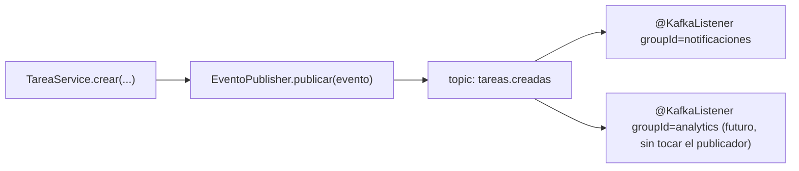
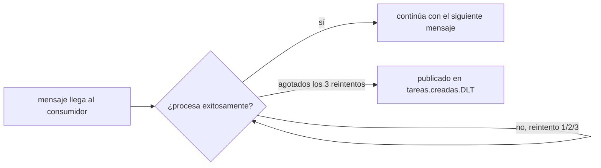

# Módulo 8: Mensajería — Kafka/RabbitMQ

Cada tema se practica por separado con su propia repetición progresiva y su propio reto de memoria, verificado contra un broker real (`@EmbeddedKafka` para Kafka, sin necesitar Docker; `RabbitMQContainer` de Testcontainers para RabbitMQ), para que "el evento se publicó y se consumió" sea comprobable, no solo descrito.


## Aprende construyendo

### Tema 1: Producers y consumers con Spring Kafka

#### Paso 1 · Objetivo y preparación

Al finalizar podrás publicar un evento con `KafkaTemplate` y consumirlo con `@KafkaListener`, confirmando con un broker Kafka real (embebido, sin Docker) que el desacoplamiento entre publicador y consumidor funciona de extremo a extremo.

**Conocimiento previo:** `@Service` e inyección de dependencias (Módulo 1); manejo global de excepciones (Módulo 2).

#### Paso 2 · Contexto y caso real

**¿Por qué es importante?** La asignación de un conductor y el envío de notificaciones no deben bloquear el request HTTP que crea una tarea; un evento desacopla al publicador de sus consumidores, permitiendo que la notificación se procese de forma independiente sin que el creador de la tarea espere por ella.

#### Paso 3 · Teoría con analogía

**Conceptos clave:** desacoplamiento vía topic, `@KafkaListener`.

```java
@Service
public class EventoPublisher {
    private final KafkaTemplate<String, TareaCreadaEvent> kafka;

    void publicar(TareaCreadaEvent evento) {
        kafka.send("tareas.creadas", evento);
    }
}
```

Este publicador envía un evento hacia un topic sin que el publicador conozca ni le importe quién está consumiendo ese evento.

```java
@KafkaListener(topics = "tareas.creadas", groupId = "notificaciones")
public void escuchar(TareaCreadaEvent evento) {
    // procesar notificación
}
```

Este listener define un consumidor completamente independiente, sin ninguna dependencia directa entre ambos. Sin mensajería, `TareaService` tendría que invocar directamente a `NotificacionService`, requiriendo que ambos estén disponibles simultáneamente.

**Analogía:** la mensajería es publicar un anuncio en un tablón público en vez de llamar personalmente a cada interesado: quien publica no necesita saber quién lo leerá, y se pueden agregar nuevos lectores sin que el publicador original haga nada distinto.

**Diagrama:**



#### Paso 4 · Demostración guiada desde cero

Desde una carpeta vacía (o continuando en `academia-spring`, o créala con `mkdir -p academia-spring` si es tu primera vez), genera el proyecto con Spring Initializr real (`web`, `kafka`) y crea el evento, el publicador y el consumidor en `src/main/java/com/academia/mensajeria/`:

```bash
mkdir -p academia-spring/src/main/java/com/academia/mensajeria
cd academia-spring
curl -fsSL https://start.spring.io/starter.zip -d dependencies=web,kafka -d javaVersion=21 -d artifactId=academia-mensajeria -o app.zip
unzip -o app.zip
```

```java
// src/main/java/com/academia/mensajeria/TareaCreadaEvent.java
package com.academia.mensajeria;

import java.io.Serializable;

public record TareaCreadaEvent(String id, String titulo) implements Serializable {}
```

```java
// src/main/java/com/academia/mensajeria/EventoPublisher.java
package com.academia.mensajeria;

import org.springframework.kafka.core.KafkaTemplate;
import org.springframework.stereotype.Service;

@Service
public class EventoPublisher {
    private final KafkaTemplate<String, TareaCreadaEvent> kafka;

    public EventoPublisher(KafkaTemplate<String, TareaCreadaEvent> kafka) { this.kafka = kafka; }

    public void publicar(TareaCreadaEvent evento) {
        kafka.send("tareas.creadas", evento.id(), evento); // clave estable: mismo id -> misma partición
    }
}
```

```java
// src/main/java/com/academia/mensajeria/NotificacionListener.java
package com.academia.mensajeria;

import org.springframework.kafka.annotation.KafkaListener;
import org.springframework.stereotype.Component;

import java.util.concurrent.CopyOnWriteArrayList;
import java.util.List;

@Component
public class NotificacionListener {
    // lista real (no un mock) donde el listener registra cada evento recibido, consultada por el test
    private final List<TareaCreadaEvent> eventosRecibidos = new CopyOnWriteArrayList<>();

    @KafkaListener(topics = "tareas.creadas", groupId = "notificaciones")
    public void escuchar(TareaCreadaEvent evento) {
        eventosRecibidos.add(evento);
    }

    public List<TareaCreadaEvent> getEventosRecibidos() { return eventosRecibidos; }
}
```

**Explicación línea por línea:** `kafka.send("tareas.creadas", evento.id(), evento)` publica usando el `id` de la tarea como clave, garantizando que eventos de la misma tarea siempre lleguen a la misma partición y por lo tanto se procesen en orden entre sí; `@KafkaListener(topics = "tareas.creadas", groupId = "notificaciones")` registra un consumidor independiente que Spring invoca automáticamente por cada mensaje del topic; `eventosRecibidos` es una lista real (no un mock) que el test consulta directamente para confirmar qué llegó efectivamente al consumidor.

Confirma con `@EmbeddedKafka` (un broker Kafka REAL que corre embebido dentro del proceso de test, sin necesitar Docker ni un Kafka externo) que un evento publicado efectivamente llega al consumidor:

```java
// src/test/java/com/academia/mensajeria/EventoPublisherTest.java
package com.academia.mensajeria;

import org.awaitility.Awaitility;
import org.junit.jupiter.api.Test;
import org.springframework.beans.factory.annotation.Autowired;
import org.springframework.boot.test.context.SpringBootTest;
import org.springframework.kafka.test.context.EmbeddedKafka;
import org.springframework.test.context.TestPropertySource;

import java.time.Duration;

import static org.assertj.core.api.Assertions.assertThat;

@SpringBootTest
@EmbeddedKafka(partitions = 1, topics = "tareas.creadas")
@TestPropertySource(properties = "spring.kafka.bootstrap-servers=${spring.embedded.kafka.brokers}")
class EventoPublisherTest {

    @Autowired
    private EventoPublisher publisher;
    @Autowired
    private NotificacionListener listener;

    @Test
    void publicarUnEventoLoEntregaAlConsumidorReal() {
        publisher.publicar(new TareaCreadaEvent("1", "Comprar leche"));

        // el consumo es asíncrono: espera activamente (con timeout real) a que el listener lo reciba
        Awaitility.await().atMost(Duration.ofSeconds(5))
            .untilAsserted(() -> assertThat(listener.getEventosRecibidos())
                .extracting(TareaCreadaEvent::titulo)
                .contains("Comprar leche"));
    }
}
```

```bash
mvn test -Dtest=EventoPublisherTest
```

**Resultado esperado:** `BUILD SUCCESS` con el test en verde: `@EmbeddedKafka` levantó un broker Kafka real dentro del proceso de test, `EventoPublisher` publicó de verdad hacia el topic `tareas.creadas`, y `NotificacionListener` —un consumidor completamente independiente, sin ninguna referencia directa al publicador— lo recibió y registró, confirmando el desacoplamiento real entre ambos.

**Fallo deliberado:** cambia el topic en `@KafkaListener(topics = "tareas.creadas", ...)` a `@KafkaListener(topics = "tareas.otro-topic", ...)` (un topic distinto al que `EventoPublisher` realmente publica) y ejecuta de nuevo. El test FALLA con un timeout de `Awaitility` (`ConditionTimeoutException`, tras esperar los 5 segundos completos sin que la condición se cumpla nunca) porque el consumidor está escuchando un topic que nunca recibe ningún mensaje — diagnostica confirmando que el acoplamiento entre publicador y consumidor, aunque no sea de compilación, SÍ existe implícitamente a través del nombre del topic: si ambos no coinciden exactamente en ese string, el desacoplamiento se convierte en una desconexión silenciosa sin ningún error de compilación que lo señale. Revierte el cambio antes de continuar.

#### Paso 5 · Práctica guiada — repetición progresiva

1. Agrega un segundo `@KafkaListener` con un `groupId` distinto escuchando el mismo topic, y confirma con el test que AMBOS reciben el mismo evento de forma independiente.
2. Publica dos eventos con la misma clave (`evento.id()`) y confirma, inspeccionando el orden en `eventosRecibidos`, que llegan en el mismo orden en que se publicaron (garantía de orden por partición cuando comparten clave).
3. Publica un evento con un `id` nulo o vacío y observa (documentando el resultado) si eso afecta a qué partición se enruta, comparado con un `id` no vacío.
4. Escribe de memoria (sin mirar) un `EventoPublisher` con `KafkaTemplate`, un `@KafkaListener` independiente, y un test `@EmbeddedKafka` con `Awaitility` que confirme la entrega. Compara después contra el patrón del Paso 4.

**Pista:** el consumo de Kafka es inherentemente asíncrono; un test que verifica el resultado inmediatamente después de `publicar(...)` sin ningún mecanismo de espera (como `Awaitility`) es una fuente clásica de tests intermitentes (flaky), porque el consumidor podría no haber procesado el mensaje todavía en ese instante exacto.

#### Paso 6 · Práctica independiente

**Completa el código:** rellena el espacio para registrar el consumidor sobre el topic correcto:

```java
@____(topics = "tareas.creadas", groupId = "notificaciones")
public void escuchar(TareaCreadaEvent evento) { }
```

**Reto de memoria sin mirar:** cierra este documento y escribe, solo de memoria, un publicador con `KafkaTemplate`, un consumidor con `@KafkaListener`, y un test `@EmbeddedKafka` que confirme la entrega con `Awaitility`. Compara después contra el patrón del Paso 4.

#### Paso 7 · Cierre y evidencia

Ya publicas y consumes eventos desacoplados con Kafka, confirmando con un broker real embebido que la entrega efectivamente ocurre de extremo a extremo. El siguiente tema aborda qué ocurre cuando el consumidor falla al procesar un mensaje. **Evidencia:** entrega el resultado de `EventoPublisherTest` en verde, y el timeout real que produce el fallo deliberado cuando publicador y consumidor no coinciden en el topic. Fuente oficial: [Spring for Apache Kafka — Testing](https://docs.spring.io/spring-kafka/reference/testing.html).

**Errores comunes:** asumir que el consumo es sincrónico y verificar el resultado sin ningún mecanismo de espera, produciendo tests intermitentes; que publicador y consumidor no coincidan exactamente en el nombre del topic, una desconexión silenciosa sin error de compilación.

**Cuándo no usarlo:** para una operación que el llamador necesita confirmar que se completó exitosamente antes de continuar (por ejemplo, verificar el stock disponible antes de confirmar una compra), una llamada síncrona directa es más apropiada que un evento asíncrono desacoplado.

Los producers y consumers de Spring Kafka que implementes aquí son los que integrará el proyecto integrador de este track (microservicio productivo, Módulo 12).

### Tema 2: Dead-letter queue

#### Paso 1 · Objetivo y preparación

Al finalizar podrás configurar reintentos limitados y una dead-letter queue para mensajes que fallan repetidamente, confirmando con un broker real que el mensaje problemático termina exactamente ahí, sin bloquear los mensajes siguientes.

**Conocimiento previo:** Tema 1 de este módulo.

#### Paso 2 · Contexto y caso real

**¿Por qué es importante?** Un mensaje con un payload corrupto o una condición que el consumidor no puede manejar no debería bloquear indefinidamente el procesamiento de todos los mensajes válidos que llegan después de él en la misma partición.

#### Paso 3 · Teoría con analogía

**Conceptos clave:** reintentos limitados, destino final para mensajes que fallan repetidamente.

```java
@Bean
DefaultErrorHandler errorHandler(KafkaTemplate<Object, Object> template) {
    var recoverer = new DeadLetterPublishingRecoverer(template);
    return new DefaultErrorHandler(recoverer, new FixedBackOff(1000L, 3));
}
```

Este bean configura reintentos limitados (3, con 1 segundo entre cada uno); si todos fallan, el mensaje se redirige automáticamente a una dead-letter queue (por convención, el mismo nombre del topic original con el sufijo `.DLT`), en vez de perderse silenciosamente o bloquear los mensajes siguientes.

**Analogía:** una dead-letter queue es una bandeja separada de correspondencia no entregable en una oficina de correos, donde las cartas que no pudieron entregarse tras varios intentos se archivan para investigación manual, en vez de bloquear indefinidamente el resto de la correspondencia normal.

**Diagrama:**



#### Paso 4 · Demostración guiada desde cero

Reutiliza `academia-spring` (o créalo desde una carpeta vacía con `mkdir -p academia-spring` si es tu primera vez) y crea la configuración de manejo de errores en `src/main/java/com/academia/mensajeria/`:

```bash
mkdir -p academia-spring/src/main/java/com/academia/mensajeria
cd academia-spring
```

```java
// src/main/java/com/academia/mensajeria/KafkaErrorConfig.java
package com.academia.mensajeria;

import org.springframework.context.annotation.Bean;
import org.springframework.context.annotation.Configuration;
import org.springframework.kafka.core.KafkaTemplate;
import org.springframework.kafka.listener.DeadLetterPublishingRecoverer;
import org.springframework.kafka.listener.DefaultErrorHandler;
import org.springframework.util.backoff.FixedBackOff;

@Configuration
public class KafkaErrorConfig {

    @Bean
    DefaultErrorHandler errorHandler(KafkaTemplate<Object, Object> template) {
        var recoverer = new DeadLetterPublishingRecoverer(template);
        return new DefaultErrorHandler(recoverer, new FixedBackOff(100L, 2)); // 2 reintentos rápidos para el test
    }
}
```

```java
// src/main/java/com/academia/mensajeria/ListenerConFalloDeliberado.java
package com.academia.mensajeria;

import org.springframework.kafka.annotation.KafkaListener;
import org.springframework.stereotype.Component;

@Component
public class ListenerConFalloDeliberado {

    @KafkaListener(topics = "pedidos.procesar", groupId = "procesador")
    public void procesar(String payload) {
        if (payload.equals("payload-invalido")) {
            throw new IllegalArgumentException("no se puede procesar: " + payload);
        }
        // procesamiento normal para cualquier otro payload
    }
}
```

**Explicación línea por línea:** `FixedBackOff(100L, 2)` declara 2 reintentos con 100ms entre cada uno (valores reducidos deliberadamente para que el test corra rápido); `ListenerConFalloDeliberado.procesar` lanza una excepción real de forma controlada para un payload específico, simulando un mensaje que el consumidor genuinamente no puede procesar; `DeadLetterPublishingRecoverer` intercepta esa excepción después de agotados los reintentos y republica el mensaje original en `pedidos.procesar.DLT`.

Confirma con `@EmbeddedKafka` que el mensaje inválido termina en la DLQ tras agotar los reintentos, mientras un mensaje válido posterior se procesa normalmente sin bloquearse:

```java
// src/test/java/com/academia/mensajeria/DeadLetterQueueTest.java
package com.academia.mensajeria;

import org.apache.kafka.clients.consumer.Consumer;
import org.apache.kafka.clients.consumer.ConsumerRecord;
import org.junit.jupiter.api.Test;
import org.springframework.beans.factory.annotation.Autowired;
import org.springframework.boot.test.context.SpringBootTest;
import org.springframework.kafka.core.KafkaTemplate;
import org.springframework.kafka.test.EmbeddedKafkaBroker;
import org.springframework.kafka.test.context.EmbeddedKafka;
import org.springframework.kafka.test.utils.KafkaTestUtils;
import org.springframework.test.context.TestPropertySource;

import java.time.Duration;
import java.util.Map;

import static org.assertj.core.api.Assertions.assertThat;

@SpringBootTest
@EmbeddedKafka(partitions = 1, topics = {"pedidos.procesar", "pedidos.procesar.DLT"})
@TestPropertySource(properties = "spring.kafka.bootstrap-servers=${spring.embedded.kafka.brokers}")
class DeadLetterQueueTest {

    @Autowired
    private KafkaTemplate<String, String> kafkaTemplate;
    @Autowired
    private EmbeddedKafkaBroker embeddedKafkaBroker;

    @Test
    void unMensajeInvalidoTerminaEnLaDeadLetterQueue() {
        kafkaTemplate.send("pedidos.procesar", "payload-invalido");

        Map<String, Object> configs = KafkaTestUtils.consumerProps("grupo-verificacion-dlq", "true", embeddedKafkaBroker);
        try (Consumer<String, String> consumidorDlq = new org.apache.kafka.clients.consumer.KafkaConsumer<>(
                configs, new org.apache.kafka.common.serialization.StringDeserializer(), new org.apache.kafka.common.serialization.StringDeserializer())) {
            embeddedKafkaBroker.consumeFromAnEmbeddedTopic(consumidorDlq, "pedidos.procesar.DLT");

            ConsumerRecord<String, String> registroEnDlq = KafkaTestUtils.getSingleRecord(consumidorDlq, "pedidos.procesar.DLT", Duration.ofSeconds(10));

            assertThat(registroEnDlq.value()).isEqualTo("payload-invalido");
        }
    }
}
```

```bash
mvn test -Dtest=DeadLetterQueueTest
```

**Resultado esperado:** `BUILD SUCCESS` con el test en verde: el mensaje `"payload-invalido"` se reintenta 2 veces (falla ambas), y `DeadLetterPublishingRecoverer` lo republica automáticamente en `pedidos.procesar.DLT`, donde el consumidor de verificación del test lo lee directamente desde ese topic real — confirmando que el mensaje problemático quedó aislado y trazable, no perdido.

**Fallo deliberado:** quita el `@Bean errorHandler` completo de `KafkaErrorConfig` (dejando el manejo de errores por defecto de Spring Kafka, sin DLQ configurada) y ejecuta de nuevo el test. El test FALLA con timeout en `KafkaTestUtils.getSingleRecord(...)` porque ningún mensaje llega a `pedidos.procesar.DLT` — sin el `errorHandler` explícito, el mensaje fallido se reintenta indefinidamente con la política por defecto, o se descarta según la configuración implícita, pero en cualquier caso NUNCA llega a la DLQ que el test espera — diagnostica confirmando que la dead-letter queue no es un comportamiento automático de Kafka, sino algo que debe configurarse explícitamente con un `DefaultErrorHandler` y un `DeadLetterPublishingRecoverer`. Revierte el cambio antes de continuar.

#### Paso 5 · Práctica guiada — repetición progresiva

1. Publica un mensaje válido inmediatamente después del inválido en el mismo test, y confirma que el mensaje válido se procesa sin ningún retraso causado por los reintentos del mensaje anterior (los reintentos son por mensaje individual, no bloquean toda la partición indefinidamente en este patrón).
2. Aumenta `FixedBackOff(100L, 2)` a `FixedBackOff(100L, 0)` (cero reintentos) y confirma que el mensaje llega a la DLQ inmediatamente tras el primer fallo, sin ningún reintento.
3. Inspecciona los headers del `ConsumerRecord` recibido en la DLQ (`registroEnDlq.headers()`) y documenta qué información adicional sobre la excepción original Spring Kafka adjunta automáticamente.
4. Escribe de memoria (sin mirar) un `DefaultErrorHandler` con `DeadLetterPublishingRecoverer`, y un test que confirme que un mensaje fallido termina en el topic `.DLT` correspondiente. Compara después contra el patrón del Paso 4.

**Pista:** el sufijo `.DLT` (Dead Letter Topic) es la convención por defecto de `DeadLetterPublishingRecoverer`; puede personalizarse, pero mantener la convención por defecto facilita que cualquier desarrollador del equipo sepa dónde buscar mensajes fallidos sin necesitar documentación adicional.

#### Paso 6 · Práctica independiente

**Completa el código:** rellena el espacio para configurar 3 reintentos con 1 segundo entre cada uno antes de enviar a la DLQ:

```java
return new DefaultErrorHandler(recoverer, new ____(1000L, 3));
```

**Reto de memoria sin mirar:** cierra este documento y escribe, solo de memoria, un `DefaultErrorHandler` con reintentos limitados y `DeadLetterPublishingRecoverer`, y un test que confirme el mensaje fallido en la DLQ. Compara después contra el patrón del Paso 4.

#### Paso 7 · Cierre y evidencia

Ya configuras reintentos limitados y una dead-letter queue real, confirmando con un broker Kafka embebido que un mensaje problemático queda aislado y trazable sin bloquear el flujo normal. El siguiente y último tema de este módulo compara Kafka con RabbitMQ para elegir según el patrón de consumo real necesario. **Evidencia:** entrega el resultado de `DeadLetterQueueTest` en verde, y el timeout que produce el fallo deliberado al quitar el `errorHandler`. Fuente oficial: [Spring for Apache Kafka — Dead Letters](https://docs.spring.io/spring-kafka/reference/retrytopic.html).

**Errores comunes:** no configurar ninguna dead-letter queue, arriesgando que un mensaje problemático bloquee o se pierda silenciosamente; no monitorear ni asignar dueño a la DLQ, dejando mensajes fallidos acumulándose sin que nadie los investigue.

**Cuándo no usarlo:** para un consumidor donde CUALQUIER fallo de procesamiento debe detener inmediatamente todo el flujo hasta que un humano intervenga (un escenario donde continuar procesando otros mensajes sería inaceptable), reintentar y luego enviar silenciosamente a una DLQ podría ocultar un problema que requiere atención inmediata en vez de diferida.

La dead-letter queue de este tema es la que evitará perder mensajes fallidos en el proyecto integrador de este track (microservicio productivo, Módulo 12).

### Tema 3: Kafka frente a RabbitMQ

#### Paso 1 · Objetivo y preparación

Al finalizar podrás implementar el mismo flujo de consumo con Spring AMQP sobre RabbitMQ real, y explicar con evidencia en qué se diferencia su modelo de entrega del de Kafka.

**Conocimiento previo:** Temas 1 y 2 de este módulo.

#### Paso 2 · Contexto y caso real

**¿Por qué es importante?** Elegir la tecnología de mensajería equivocada para el patrón de consumo real necesario (retención y relectura de historial vs. distribución simple de trabajo) genera complejidad innecesaria o limitaciones inesperadas más adelante.

#### Paso 3 · Teoría con analogía

**Conceptos clave:** log distribuido retenido frente a broker de colas tradicional.

`@RabbitListener(queues = "tareas.creadas") public void escuchar(TareaCreadaEvent evento) { ... }` es sintácticamente muy similar a `@KafkaListener`, pero el modelo subyacente es distinto: Kafka es un log distribuido que retiene mensajes durante un período configurable independientemente de si ya fueron consumidos, permitiendo que múltiples consumidores (o el mismo, releyendo desde un punto anterior) lean el mismo stream completo; RabbitMQ es un broker de colas tradicional, donde un mensaje típicamente se entrega y se elimina de la cola una vez consumido (patrón punto-a-punto).

**Analogía:** Kafka es un registro público permanente que cualquiera puede consultar en cualquier momento, incluso eventos ya "vistos" antes; RabbitMQ es un sistema de reparto de correspondencia donde cada carta se entrega a su destinatario y luego se considera completada, sin quedar disponible para que alguien más la vuelva a leer.

**Diagrama:**

```
┌── Kafka: log distribuido ────────────────────────┐
│  retiene mensajes; múltiples consumidores leen el      │
│  mismo stream completo, incluso ya "consumido" antes    │
└──────────────────────────────────────────────┘
┌── RabbitMQ: broker de colas tradicional ─────────┐
│  mensaje entregado y eliminado de la cola;              │
│  más simple para distribución punto-a-punto             │
└──────────────────────────────────────────────┘
```

#### Paso 4 · Demostración guiada desde cero

Desde una carpeta vacía (o continuando en `academia-spring`, o créala con `mkdir -p academia-spring` si es tu primera vez), agrega la dependencia real `spring-boot-starter-amqp` y crea `src/main/java/com/academia/mensajeria/RabbitConfig.java` con el equivalente en RabbitMQ del publicador/consumidor del Tema 1:

```bash
mkdir -p academia-spring/src/main/java/com/academia/mensajeria
cd academia-spring
```

```java
// src/main/java/com/academia/mensajeria/RabbitConfig.java
package com.academia.mensajeria;

import org.springframework.amqp.core.Queue;
import org.springframework.context.annotation.Bean;
import org.springframework.context.annotation.Configuration;

@Configuration
public class RabbitConfig {
    @Bean
    Queue colaTareasCreadas() { return new Queue("tareas.creadas.rabbit", true); }
}
```

```java
// src/main/java/com/academia/mensajeria/RabbitListenerTareas.java
package com.academia.mensajeria;

import org.springframework.amqp.rabbit.annotation.RabbitListener;
import org.springframework.stereotype.Component;

import java.util.List;
import java.util.concurrent.CopyOnWriteArrayList;

@Component
public class RabbitListenerTareas {
    private final List<String> mensajesRecibidos = new CopyOnWriteArrayList<>();

    @RabbitListener(queues = "tareas.creadas.rabbit")
    public void escuchar(String titulo) {
        mensajesRecibidos.add(titulo);
    }

    public List<String> getMensajesRecibidos() { return mensajesRecibidos; }
}
```

Confirma con `RabbitMQContainer` (el contenedor Docker real y oficial de Testcontainers para RabbitMQ, la misma técnica de fidelidad real que `PostgreSQLContainer` en el Módulo 6) que publicar y consumir vía RabbitMQ funciona, y a la vez ilustra la diferencia con Kafka: consume el mensaje UNA vez y confirma que releerlo después no lo entrega de nuevo:

```java
// src/test/java/com/academia/mensajeria/RabbitVsKafkaTest.java
package com.academia.mensajeria;

import org.junit.jupiter.api.Test;
import org.springframework.amqp.rabbit.core.RabbitTemplate;
import org.springframework.beans.factory.annotation.Autowired;
import org.springframework.boot.test.context.SpringBootTest;
import org.springframework.test.context.DynamicPropertyRegistry;
import org.springframework.test.context.DynamicPropertySource;
import org.testcontainers.containers.RabbitMQContainer;
import org.testcontainers.junit.jupiter.Container;
import org.testcontainers.junit.jupiter.Testcontainers;

import java.time.Duration;

import static org.assertj.core.api.Assertions.assertThat;
import static org.awaitility.Awaitility.await;

@SpringBootTest
@Testcontainers
class RabbitVsKafkaTest {

    @Container
    static RabbitMQContainer rabbit = new RabbitMQContainer("rabbitmq:3.13-management");

    @DynamicPropertySource
    static void propiedades(DynamicPropertyRegistry registry) {
        registry.add("spring.rabbitmq.host", rabbit::getHost);
        registry.add("spring.rabbitmq.port", rabbit::getAmqpPort);
    }

    @Autowired
    private RabbitTemplate rabbitTemplate;
    @Autowired
    private RabbitListenerTareas listener;

    @Test
    void unMensajeDeRabbitSeEntregaUnaSolaVezYLuegoDesaparece() {
        rabbitTemplate.convertAndSend("tareas.creadas.rabbit", "Comprar leche");

        await().atMost(Duration.ofSeconds(5))
            .untilAsserted(() -> assertThat(listener.getMensajesRecibidos()).contains("Comprar leche"));

        // a diferencia de Kafka (Tema 1), RabbitMQ elimina el mensaje de la cola tras entregarlo:
        // no hay forma de "releerlo" de nuevo como con un consumer group nuevo sobre el mismo topic
        Object mensajePendiente = rabbitTemplate.receiveAndConvert("tareas.creadas.rabbit");
        assertThat(mensajePendiente).isNull();
    }
}
```

```bash
# requiere Docker corriendo localmente; Testcontainers levanta el broker RabbitMQ real
mvn test -Dtest=RabbitVsKafkaTest
```

**Resultado esperado:** `BUILD SUCCESS` con el test en verde: el mensaje se entrega al listener real vía RabbitMQ, y al intentar leer la cola de nuevo directamente (`receiveAndConvert`), no queda ningún mensaje pendiente — confirmando en código, no solo en teoría, la diferencia central con Kafka (Tema 1): RabbitMQ elimina el mensaje de la cola tras la entrega, mientras Kafka lo retiene y permitiría que un nuevo `groupId` lo releyera desde el principio del topic.

**Fallo deliberado:** intenta releer el mismo mensaje con un `RabbitListener` adicional usando un `groupId` conceptualmente equivalente al de Kafka (RabbitMQ no tiene el concepto de `groupId`; si agregas un SEGUNDO `@RabbitListener(queues = "tareas.creadas.rabbit")` en otra clase, ambos listeners COMPITEN por los mensajes de la misma cola, cada mensaje se entrega a SOLO UNO de los dos, no a ambos). Verifica esto agregando un segundo listener y confirmando que la suma de mensajes recibidos por ambos, no cada uno por separado, coincide con el total publicado — diagnostica confirmando que RabbitMQ implementa competencia de consumidores (distribución de trabajo) sobre una cola, fundamentalmente distinto del fan-out real que Kafka logra con múltiples `groupId` independientes, cada uno recibiendo TODOS los mensajes (Tema 1, Paso 5, punto 1).

#### Paso 5 · Práctica guiada — repetición progresiva

1. Agrega un segundo test que confirme la competencia de consumidores: dos `@RabbitListener` sobre la misma cola, publica 10 mensajes, y confirma que la SUMA de lo recibido por ambos es 10 (no 20, como sería con dos `@KafkaListener` con `groupId` distintos sobre el mismo topic).
2. Configura la cola de RabbitMQ como `durable = false` y documenta, basándote en la documentación oficial, qué pasaría con los mensajes pendientes si el broker se reiniciara.
3. Compara el tiempo de arranque del contenedor `RabbitMQContainer` (Tema 3) frente a `@EmbeddedKafka` (Temas 1-2) ejecutando ambas suites y observando los tiempos reportados por Maven.
4. Escribe de memoria (sin mirar) una tabla de dos columnas comparando Kafka y RabbitMQ en retención, patrón de consumo y fan-out real vs. competencia de consumidores. Compara después contra el patrón del Paso 4.

**Pista:** la pregunta que determina la elección correcta no es "¿cuál es más rápido o más popular?", sino "¿necesito que MÚLTIPLES consumidores independientes reciban CADA UNO su propia copia completa del mismo mensaje (Kafka), o necesito distribuir CADA mensaje entre UN SOLO trabajador de un pool (RabbitMQ)?".

#### Paso 6 · Práctica independiente

**Completa el código:** rellena el espacio para registrar el consumidor sobre la cola de RabbitMQ:

```java
@____(queues = "tareas.creadas.rabbit")
public void escuchar(String titulo) { }
```

**Reto de memoria sin mirar:** cierra este documento y escribe, solo de memoria, un test que confirme que RabbitMQ elimina un mensaje de la cola tras entregarlo, a diferencia de la retención de Kafka. Compara después contra el patrón del Paso 4.

#### Paso 7 · Cierre y evidencia

Ya implementas el mismo patrón de consumo desacoplado sobre RabbitMQ real, confirmando con evidencia de código la diferencia central de modelo de entrega frente a Kafka. Esto cierra el módulo de mensajería; el siguiente módulo aborda cómo estructurar el código de dominio con principios de arquitectura hexagonal. **Evidencia:** entrega el resultado de `RabbitVsKafkaTest` en verde, y la confirmación de que dos listeners sobre la misma cola de RabbitMQ compiten por los mensajes en vez de recibir cada uno una copia completa. Fuente oficial: [Spring AMQP Reference](https://docs.spring.io/spring-amqp/reference/).

**Errores comunes:** confundir el modelo de retención de Kafka con el de RabbitMQ, asumiendo que ambos permiten releer el historial completo; asumir que agregar un segundo `@RabbitListener` sobre la misma cola duplicará la entrega, cuando en realidad divide el trabajo entre ambos.

**Cuándo no usarlo:** para un flujo que necesita garantías de ordenamiento estricto y reprocesamiento completo del historial de eventos de negocio (auditoría, event sourcing), RabbitMQ por sí solo no ofrece esa retención; Kafka es la elección más apropiada para ese patrón específico.

---

La comparación Kafka frente a RabbitMQ de este tema es la que justificará la elección de mensajería del proyecto integrador de este track (microservicio productivo, Módulo 12).

## Laboratorio práctico

**Objetivo del laboratorio:** construir un servicio que publica y consume eventos vía Kafka con manejo robusto de errores.

**Requisitos previos:** Módulos 0-7 completados.

| Paso | Acción | Código | Explicación |
|---|---|---|---|
| 1 | Levantar un broker Kafka embebido en los tests | Ver Tema 1 | `@EmbeddedKafka`, sin Docker |
| 2 | Implementar un `@KafkaListener` | Ver Tema 1 | Consume y procesa el evento real |
| 3 | Confirmar la entrega con `Awaitility` | Ver Tema 1 | El consumo es asíncrono |
| 4 | Configurar reintentos y dead-letter queue | Ver Tema 2 | Verifica el mensaje fallido en `.DLT` real |
| 5 | Repetir con RabbitMQ y comparar | Ver Tema 3 | `RabbitMQContainer`, compara los modelos de entrega |

**Verificación:** el laboratorio se considera exitoso si un mensaje que falla repetidamente termina correctamente en la dead-letter queue real tras agotar los reintentos, sin bloquear el procesamiento de mensajes posteriores exitosos, y si la diferencia de modelo de entrega entre Kafka y RabbitMQ está confirmada con evidencia de test, no solo descrita.

**Errores comunes y soluciones**

- **No configurar una dead-letter queue.** Sin ella, un mensaje que falla repetidamente puede bloquear o perderse silenciosamente.
- **Confundir el modelo de retención de Kafka con el de RabbitMQ.** Verifica cuál patrón de consumo real necesita tu caso de uso antes de elegir.
- **No serializar explícitamente el formato del mensaje.** Configura un serializer explícito para evitar ambigüedad de formato entre productor y consumidor.

---
