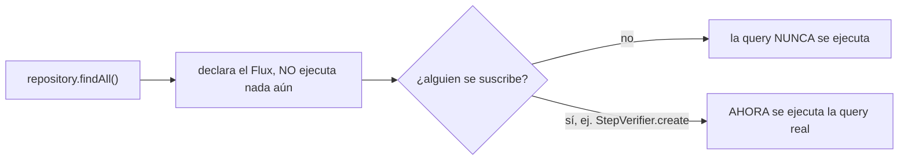
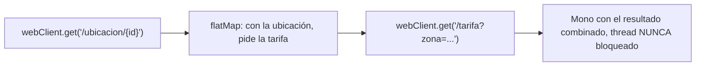

# Módulo 9: Programación reactiva con WebFlux


## Comienza desde cero: crea una API WebFlux ejecutable

Este capítulo no presupone que ya tienes una aplicación reactiva. Crearás `rutaflow-reactive`, una API mínima que guarda entregas en H2 mediante R2DBC y expone un flujo HTTP. Primero harás funcionar una vertical pequeña; después introducirás `WebClient` y compararás el resultado con MVC.

### 1. Comprueba el entorno antes de generar archivos

Necesitas JDK 21, Git y una herramienta para descomprimir. Maven no se instala globalmente porque el proyecto incluirá Maven Wrapper.

```bash
java --version
javac --version
git --version
curl --version
```

`java` y `javac` deben mostrar la misma familia de versión. Si `java` existe pero `javac` no, instalaste únicamente un entorno de ejecución o tu `PATH` apunta a una instalación incompleta. Corrige esto antes de descargar Spring.

### 2. Genera el proyecto con Spring Initializr

En macOS, Linux o WSL:

```bash
mkdir -p academia-labs && cd academia-labs

curl -G https://start.spring.io/starter.zip \
  -d type=maven-project \
  -d language=java \
  -d javaVersion=21 \
  -d groupId=io.academia \
  -d artifactId=rutaflow-reactive \
  -d name=rutaflow-reactive \
  -d packageName=io.academia.rutaflow \
  -d dependencies=webflux,data-r2dbc,h2,validation \
  -o rutaflow-reactive.zip

unzip rutaflow-reactive.zip -d rutaflow-reactive
cd rutaflow-reactive
./mvnw test
```

En Windows PowerShell puedes crear el mismo proyecto desde [start.spring.io](https://start.spring.io/) seleccionando Maven, Java, JDK 21 y las dependencias **Spring Reactive Web**, **Spring Data R2DBC**, **H2 Database** y **Validation**. Descomprime el ZIP, abre PowerShell dentro de la carpeta y ejecuta:

```powershell
.\mvnw.cmd test
```

**Resultado esperado:** Maven termina con `BUILD SUCCESS`. Si aparece `UnsupportedClassVersionError`, el wrapper está usando otro JDK; revisa `$Env:JAVA_HOME` en PowerShell o `echo $JAVA_HOME` en macOS/Linux.

### 3. Crea una estructura pequeña y explícita

Dentro de `src/main/java/io/academia/rutaflow/` crea:

```text
rutaflow-reactive/
├─ pom.xml
├─ src/main/java/io/academia/rutaflow/
│  ├─ RutaflowReactiveApplication.java
│  └─ delivery/
│     ├─ Delivery.java
│     ├─ DeliveryRepository.java
│     └─ DeliveryController.java
├─ src/main/resources/
│  ├─ application.yml
│  └─ schema.sql
└─ src/test/java/io/academia/rutaflow/delivery/
   └─ DeliveryControllerTest.java
```

La carpeta `delivery` agrupa una capacidad del dominio. Evita crear carpetas globales llamadas `controllers`, `services` y `repositories` para toda la aplicación: cuando el proyecto crece, obligan a saltar entre directorios para comprender una sola funcionalidad.

### 4. Configura una base reactiva local

Guarda `src/main/resources/application.yml`:

```yaml
spring:
  application:
    name: rutaflow-reactive
  r2dbc:
    url: r2dbc:h2:mem:///rutaflow;DB_CLOSE_DELAY=-1
    username: sa
    password: ""
  sql:
    init:
      mode: always
server:
  port: 8080
```

Guarda `src/main/resources/schema.sql`:

```sql
CREATE TABLE IF NOT EXISTS delivery (
  id BIGINT GENERATED BY DEFAULT AS IDENTITY PRIMARY KEY,
  tracking_code VARCHAR(40) NOT NULL UNIQUE,
  status VARCHAR(30) NOT NULL
);
```

H2 permite aprender el flujo sin instalar PostgreSQL. No lo confundas con producción: antes de desplegar debes repetir las pruebas contra el motor y driver R2DBC reales.

### 5. Implementa el modelo y el repositorio

`src/main/java/io/academia/rutaflow/delivery/Delivery.java`:

```java
package io.academia.rutaflow.delivery;

import org.springframework.data.annotation.Id;
import org.springframework.data.relational.core.mapping.Table;

@Table("delivery")
public record Delivery(
    @Id Long id,
    String trackingCode,
    String status
) {}
```

`src/main/java/io/academia/rutaflow/delivery/DeliveryRepository.java`:

```java
package io.academia.rutaflow.delivery;

import org.springframework.data.repository.reactive.ReactiveCrudRepository;
import reactor.core.publisher.Mono;

public interface DeliveryRepository
    extends ReactiveCrudRepository<Delivery, Long> {

  Mono<Delivery> findByTrackingCode(String trackingCode);
}
```

`ReactiveCrudRepository` devuelve `Mono` y `Flux`; no oculta JDBC bloqueante detrás de esos tipos. Spring Boot configura el `ConnectionFactory` R2DBC a partir de `spring.r2dbc.*`, siguiendo el modelo documentado oficialmente por Spring Boot.

### 6. Expón endpoints sin llamar subscribe()

`src/main/java/io/academia/rutaflow/delivery/DeliveryController.java`:

```java
package io.academia.rutaflow.delivery;

import org.springframework.http.HttpStatus;
import org.springframework.web.bind.annotation.*;
import reactor.core.publisher.Flux;
import reactor.core.publisher.Mono;

@RestController
@RequestMapping("/deliveries")
public final class DeliveryController {
  private final DeliveryRepository repository;

  public DeliveryController(DeliveryRepository repository) {
    this.repository = repository;
  }

  @GetMapping
  public Flux<Delivery> findAll() {
    return repository.findAll();
  }

  @GetMapping("/{trackingCode}")
  public Mono<Delivery> findOne(@PathVariable String trackingCode) {
    return repository.findByTrackingCode(trackingCode);
  }

  @PostMapping
  @ResponseStatus(HttpStatus.CREATED)
  public Mono<Delivery> create(@RequestBody Delivery input) {
    Delivery unsaved = new Delivery(null, input.trackingCode(), "CREATED");
    return repository.save(unsaved);
  }
}
```

No llames `subscribe()` dentro del controller. Al devolver el `Publisher`, WebFlux controla la suscripción, cancelación y escritura de la respuesta HTTP. Suscribirte manualmente separaría el trabajo de la respuesta y dificultaría propagar errores.

### 7. Ejecuta y observa un resultado concreto

```bash
./mvnw spring-boot:run
```

En otra terminal:

```bash
curl -i -X POST http://localhost:8080/deliveries \
  -H 'Content-Type: application/json' \
  -d '{"trackingCode":"RF-001","status":"IGNORED"}'

curl -i http://localhost:8080/deliveries/RF-001
curl -i http://localhost:8080/deliveries
```

Debes observar `201 Created` al crear, un objeto con estado `CREATED` al consultar y un arreglo con una entrega al listar. Si recibes `404`, verifica la ruta y que el proceso continúe ejecutándose. Si recibes `500`, lee desde la primera excepción `Caused by` en la terminal; no corrijas al azar la última línea del stack trace.

### 8. Provoca tres fallos antes de continuar

1. Envía dos veces `RF-001`: la restricción `UNIQUE` debe producir un error. El siguiente incremento será traducirlo a `409 Conflict`.
2. Cambia temporalmente la URL R2DBC por una inválida: la aplicación debe fallar de forma visible, no devolver una lista vacía engañosa.
3. Añade `Thread.sleep(3000)` dentro de `findAll()`, ejecuta varias peticiones y observa por qué bloquear el event loop degrada todas las conexiones. Retira el bloqueo y conserva la explicación en README.

Con esto tienes un proyecto mínimo reproducible. Ahora sí tiene sentido estudiar con detalle `Mono`, `Flux`, `WebClient`, backpressure y las decisiones frente a MVC.

## Aprende construyendo

Cada tema se practica por separado con su propia repetición progresiva y su propio reto de memoria, verificado con `StepVerifier` (la herramienta oficial de test de Project Reactor, que suscribe de verdad y verifica cada señal emitida) y `MockWebServer` (un servidor HTTP real y desechable), para que "es perezoso" o "no bloquea el thread" sean afirmaciones comprobables, no solo descritas. Continúa sobre `rutaflow-reactive`, el proyecto construido en la sección anterior.

### Tema 1: Mono y Flux

#### Paso 1 · Objetivo y preparación

Al finalizar podrás distinguir `Mono` de `Flux` por su cardinalidad, y confirmar con `StepVerifier` real que ninguno de los dos ejecuta su lógica productora hasta que existe un suscriptor.

**Conocimiento previo:** la sección "Comienza desde cero" de este módulo (proyecto `rutaflow-reactive` con `DeliveryRepository` reactivo).

#### Paso 2 · Contexto y caso real

**¿Por qué es importante?** Una API de entregas que combina ubicación, tarifa y disponibilidad necesita modelar explícitamente si cada operación espera cero-o-un resultado (`Mono`, como buscar una entrega por código) o cero-a-N resultados (`Flux`, como listar todas las entregas), sin bloquear un thread por cada espera de red o de base de datos.

#### Paso 3 · Teoría con analogía

**Conceptos clave:** 0 o 1 elemento frente a 0 a N elementos, evaluación perezosa con suscripción.

`Mono<Delivery> entrega = repository.findByTrackingCode(codigo);` representa un flujo reactivo de cero o un elemento; `Flux<Delivery> entregas = repository.findAll();` representa un flujo de cero a N elementos. Ambos son perezosos por diseño: no ejecutan ninguna lógica productora (ni siquiera la query contra la base de datos) hasta que alguien efectivamente se suscribe, con Spring suscribiéndose automáticamente cuando un `@RestController` reactivo devuelve un `Mono`/`Flux` como resultado de un endpoint.

**Analogía:** `Mono` es un recibo de entrega que promete traer cero o un paquete específico en el futuro; `Flux` es una cinta transportadora que entregará una secuencia de paquetes a lo largo del tiempo, sin que ninguno de los dos comience a producir realmente hasta que alguien se registre para recibirlos.

**Diagrama:**



#### Paso 4 · Demostración guiada desde cero

Continuando en `rutaflow-reactive` (o, si prefieres un ejemplo independiente, parte de una carpeta vacía con `mkdir rutaflow-reactive && cd rutaflow-reactive && curl -fsSL https://start.spring.io/starter.zip -d dependencies=webflux -d javaVersion=21 -o app.zip && unzip app.zip`), agrega el starter de test de Reactor (`io.projectreactor:reactor-test`, incluido por defecto al generar el proyecto con `webflux`) y crea el test de evaluación perezosa en `src/test/java/io/academia/rutaflow/delivery/`:

```bash
mkdir -p rutaflow-reactive/src/test/java/io/academia/rutaflow/delivery
cd rutaflow-reactive
```

```java
// src/test/java/io/academia/rutaflow/delivery/MonoFluxPerezosoTest.java
package io.academia.rutaflow.delivery;

import org.junit.jupiter.api.Test;
import reactor.core.publisher.Flux;
import reactor.core.publisher.Mono;
import reactor.test.StepVerifier;

import java.util.concurrent.atomic.AtomicBoolean;

class MonoFluxPerezosoTest {

    @Test
    void unMonoNoEjecutaSuLogicaHastaQueAlguienSeSuscribe() {
        AtomicBoolean seEjecuto = new AtomicBoolean(false);

        Mono<String> mono = Mono.fromCallable(() -> {
            seEjecuto.set(true);
            return "Comprar leche";
        });

        // declarar el Mono NO lo ejecuta: la aserción se cumple ANTES de suscribirse
        assert !seEjecuto.get() : "el Mono se ejecutó sin que nadie se suscribiera";

        StepVerifier.create(mono) // AHORA StepVerifier se suscribe de verdad
            .expectNext("Comprar leche")
            .verifyComplete();

        assert seEjecuto.get() : "el Mono debería haberse ejecutado tras la suscripción real de StepVerifier";
    }

    @Test
    void unFluxEmiteExactamenteLosElementosDeclarados() {
        Flux<String> flux = Flux.just("Comprar leche", "Pagar factura", "Lavar el auto");

        StepVerifier.create(flux)
            .expectNext("Comprar leche")
            .expectNext("Pagar factura")
            .expectNext("Lavar el auto")
            .verifyComplete();
    }
}
```

```bash
./mvnw test -Dtest=MonoFluxPerezosoTest
```

**Resultado esperado:** `BUILD SUCCESS` con ambos tests en verde: el primero confirma con evidencia real (`AtomicBoolean`, no una suposición) que `Mono.fromCallable(...)` no ejecuta su lambda hasta que `StepVerifier.create(mono)` se suscribe; el segundo confirma que un `Flux` emite exactamente los elementos declarados, en el orden declarado, y luego completa.

**Fallo deliberado:** cambia `expectNext("Pagar factura")` por `expectNext("Factura pagada")` (un texto distinto al realmente emitido) y ejecuta de nuevo `unFluxEmiteExactamenteLosElementosDeclarados`. El test FALLA con un mensaje real de `StepVerifier`: `expectation "expectNext(Factura pagada)" failed (expected value: Factura pagada; actual value: Pagar factura)` — diagnostica confirmando que `StepVerifier` verifica cada elemento emitido en su posición exacta de la secuencia, no solo que "algo" fue emitido. Revierte el cambio antes de continuar.

#### Paso 5 · Práctica guiada — repetición progresiva

1. Agrega un test que confirme, con `StepVerifier`, que un `Mono.empty()` completa sin emitir ningún elemento (`verifyComplete()` inmediatamente, sin `expectNext`).
2. Agrega un test que confirme que un `Flux` con un error (`Flux.error(new RuntimeException("fallo"))`) se verifica con `expectError(RuntimeException.class)` en vez de `verifyComplete()`.
3. Encadena `.map(...)` sobre el `Flux` del Paso 4 y confirma con `StepVerifier` que la transformación se refleja en cada elemento emitido.
4. Escribe de memoria (sin mirar) un test `StepVerifier` que confirme la evaluación perezosa de un `Mono.fromCallable(...)` usando un `AtomicBoolean`. Compara después contra el patrón del Paso 4.

**Pista:** `StepVerifier.create(publisher)` no ejecuta nada por sí solo hasta que llamas a `.verifyComplete()`, `.verifyError()` o un método `.verify*()` equivalente al final de la cadena — ese método final es el que dispara la suscripción real.

#### Paso 6 · Práctica independiente

**Completa el código:** rellena el espacio para verificar que el `Flux` completa exitosamente tras emitir todos sus elementos:

```java
StepVerifier.create(flux)
    .expectNext("Comprar leche")
    .____();
```

**Reto de memoria sin mirar:** cierra este documento y escribe, solo de memoria, un test `StepVerifier` que confirme la cardinalidad de un `Mono` (cero o un elemento) y de un `Flux` (varios elementos en orden). Compara después contra el patrón del Paso 4.

#### Paso 7 · Cierre y evidencia

Ya distingues `Mono` de `Flux` por su cardinalidad, y confirmas con `StepVerifier` real que ambos son perezosos hasta la suscripción. El siguiente tema compone llamadas HTTP salientes sin bloquear el thread durante la espera. **Evidencia:** entrega el resultado de ambos tests de `MonoFluxPerezosoTest` en verde, y el mensaje de error real que produce el fallo deliberado. Fuente oficial: [Project Reactor — Testing](https://projectreactor.io/docs/core/release/reference/testing.html).

**Errores comunes:** llamar `.block()` dentro de un flujo reactivo para "simplificar" el código, anulando por completo el beneficio no bloqueante; asumir que declarar un `Mono`/`Flux` ya ejecutó su lógica, sin considerar que nada ocurre hasta la suscripción.

**Cuándo no usarlo:** para lógica de negocio puramente síncrona sin ninguna espera de I/O real (cálculos en memoria), envolver el resultado en un `Mono` no aporta ningún beneficio y solo agrega complejidad de composición innecesaria.

### Tema 2: WebClient y composición no bloqueante

#### Paso 1 · Objetivo y preparación

Al finalizar podrás componer dos llamadas HTTP dependientes con `WebClient` y `flatMap`, confirmando contra un servidor HTTP real (no simulado en otro lenguaje) que ninguna llamada bloquea el thread.

**Conocimiento previo:** Tema 1 de este módulo.

#### Paso 2 · Contexto y caso real

**¿Por qué es importante?** Calcular el costo total de una entrega puede requerir consultar primero la ubicación del destinatario y luego, con esa ubicación, consultar la tarifa correspondiente a esa zona — dos llamadas HTTP dependientes entre sí que no deberían bloquear un thread completo durante toda la espera combinada de ambas.

#### Paso 3 · Teoría con analogía

**Conceptos clave:** thread libre mientras espera I/O, composición con `flatMap`.

`WebClient` reemplaza al histórico `RestTemplate` (ahora legado) para llamadas HTTP salientes completamente no bloqueantes: `Mono<Usuario> usuario = webClient.get().uri("/usuarios/{id}", id).retrieve().bodyToMono(Usuario.class);` inicia la petición sin bloquear el thread actual, liberándolo para atender otras peticiones concurrentes. `usuario.flatMap(u -> webClient.get().uri("/pedidos/{id}", u.pedidoId()).retrieve().bodyToMono(Pedido.class))` compone dos llamadas dependientes sin bloquear en ningún punto de la cadena, de forma análoga a `thenCompose` de `CompletableFuture`.

**Analogía:** `WebClient` es un mensajero que, tras enviar una solicitud, no se queda esperando parado frente a la puerta hasta recibir la respuesta, sino que atiende otras tareas mientras tanto, volviendo a ocuparse de esa solicitud únicamente cuando la respuesta efectivamente llega.

**Diagrama:**



#### Paso 4 · Demostración guiada desde cero

Continuando en `rutaflow-reactive` (o, si prefieres un ejemplo independiente, parte de una carpeta vacía con `mkdir rutaflow-reactive && cd rutaflow-reactive && mvn archetype:generate` o el generador de start.spring.io con `webflux`), crea el servicio de tarifas que compone dos llamadas HTTP en `src/main/java/io/academia/rutaflow/delivery/`:

```bash
mkdir -p rutaflow-reactive/src/main/java/io/academia/rutaflow/delivery
cd rutaflow-reactive
```

```java
// src/main/java/io/academia/rutaflow/delivery/TarifaClient.java
package io.academia.rutaflow.delivery;

import org.springframework.stereotype.Service;
import org.springframework.web.reactive.function.client.WebClient;
import reactor.core.publisher.Mono;

@Service
public class TarifaClient {
    private final WebClient webClient;

    public TarifaClient(WebClient.Builder builder, String baseUrl) {
        this.webClient = builder.baseUrl(baseUrl).build();
    }

    public Mono<String> obtenerUbicacion(String trackingCode) {
        return webClient.get().uri("/ubicacion/{codigo}", trackingCode)
            .retrieve()
            .bodyToMono(String.class);
    }

    public Mono<Double> obtenerTarifa(String zona) {
        return webClient.get().uri("/tarifa?zona={zona}", zona)
            .retrieve()
            .bodyToMono(Double.class);
    }

    public Mono<Double> calcularTarifaCompleta(String trackingCode) {
        return obtenerUbicacion(trackingCode)
            .flatMap(this::obtenerTarifa); // segunda llamada depende del resultado de la primera, sin bloquear
    }
}
```

**Explicación línea por línea:** `WebClient.Builder builder` se inyecta y configura con la URL base del servicio externo; `obtenerUbicacion` y `obtenerTarifa` son cada una una llamada HTTP no bloqueante independiente; `calcularTarifaCompleta` las compone con `flatMap`, de forma que la segunda llamada solo se dispara cuando la primera efectivamente responde, sin que el thread actual quede bloqueado esperando ninguna de las dos.

Confirma con `MockWebServer` (un servidor HTTP real, ligero y desechable, de OkHttp — no una simulación en otro lenguaje, sino un servidor HTTP que responde peticiones reales) que la composición funciona de extremo a extremo:

```java
// src/test/java/io/academia/rutaflow/delivery/TarifaClientTest.java
package io.academia.rutaflow.delivery;

import mockwebserver3.MockResponse;
import mockwebserver3.MockWebServer;
import org.junit.jupiter.api.AfterEach;
import org.junit.jupiter.api.BeforeEach;
import org.junit.jupiter.api.Test;
import org.springframework.web.reactive.function.client.WebClient;
import reactor.test.StepVerifier;

import java.io.IOException;

class TarifaClientTest {

    private MockWebServer servidor;
    private TarifaClient cliente;

    @BeforeEach
    void iniciar() throws IOException {
        servidor = new MockWebServer();
        servidor.start();
        cliente = new TarifaClient(WebClient.builder(), servidor.url("/").toString());
    }

    @AfterEach
    void detener() throws IOException {
        servidor.shutdown();
    }

    @Test
    void calcularTarifaCompletaComponeAmbasLlamadasReales() {
        servidor.enqueue(new MockResponse.Builder().body("\"zona-sur\"").addHeader("Content-Type", "application/json").build());
        servidor.enqueue(new MockResponse.Builder().body("15.5").addHeader("Content-Type", "application/json").build());

        StepVerifier.create(cliente.calcularTarifaCompleta("RF-001"))
            .expectNext(15.5)
            .verifyComplete();
    }
}
```

```bash
./mvnw test -Dtest=TarifaClientTest
```

**Resultado esperado:** `BUILD SUCCESS` con el test en verde: `MockWebServer` respondió a AMBAS peticiones HTTP reales (primero la ubicación, luego la tarifa de esa zona), y `calcularTarifaCompleta` compuso correctamente ambas respuestas en un único `Mono` que emite `15.5`.

**Fallo deliberado:** en `TarifaClientTest`, encola solo UNA respuesta (`servidor.enqueue(...)` una sola vez) en vez de dos, y ejecuta de nuevo el test. La segunda llamada HTTP (`obtenerTarifa`, disparada por el `flatMap`) se queda esperando una respuesta que `MockWebServer` no tiene encolada, y el test falla por timeout — diagnostica confirmando que `flatMap` efectivamente dispara una SEGUNDA petición HTTP real y dependiente, no solo transforma un valor en memoria: sin una respuesta real para esa segunda llamada, la composición completa no puede completar. Revierte el cambio antes de continuar.

#### Paso 5 · Práctica guiada — repetición progresiva

1. Agrega un test que confirme, usando `servidor.enqueue(new MockResponse.Builder().code(500).build())`, que un error HTTP real de la primera llamada se propaga como un error en el `Mono` compuesto (`StepVerifier...verifyError()`).
2. Agrega un timeout explícito (`.timeout(Duration.ofSeconds(2))`) a `calcularTarifaCompleta` y confirma con `MockWebServer` que, si una respuesta tarda más que ese timeout (`new MockResponse.Builder().bodyDelay(3, TimeUnit.SECONDS)...`), el `Mono` termina en error de timeout en vez de esperar indefinidamente.
3. Compón tres llamadas en vez de dos usando `Mono.zip(...)` (en vez de `flatMap` encadenado) para dos llamadas independientes entre sí, y confirma con `MockWebServer` que ambas se disparan y combinan correctamente.
4. Escribe de memoria (sin mirar) un `WebClient` que componga dos llamadas dependientes con `flatMap`, y un test `MockWebServer` + `StepVerifier` que confirme el resultado combinado. Compara después contra el patrón del Paso 4.

**Pista:** `MockWebServer` entrega las respuestas encoladas en el ORDEN en que las recibe, no según qué endpoint específico se solicitó — si tu test tiene múltiples llamadas a rutas distintas, el orden de `servidor.enqueue(...)` debe coincidir con el orden real en que tu código las dispara.

#### Paso 6 · Práctica independiente

**Completa el código:** rellena el espacio para componer la segunda llamada dependiente del resultado de la primera:

```java
public Mono<Double> calcularTarifaCompleta(String trackingCode) {
    return obtenerUbicacion(trackingCode)
        .____(this::obtenerTarifa);
}
```

**Reto de memoria sin mirar:** cierra este documento y escribe, solo de memoria, un `WebClient` con dos llamadas HTTP compuestas por `flatMap`, y un test con `MockWebServer` que confirme el resultado. Compara después contra el patrón del Paso 4.

#### Paso 7 · Cierre y evidencia

Ya compones llamadas HTTP dependientes con `WebClient` sin bloquear el thread, confirmado contra un servidor HTTP real y desechable. El siguiente y último tema de este módulo aborda cuándo esta complejidad adicional realmente vale la pena. **Evidencia:** entrega el resultado de `TarifaClientTest` en verde, y el timeout real que produce el fallo deliberado al faltar una respuesta encolada. Fuente oficial: [Spring — WebClient](https://docs.spring.io/spring-framework/reference/web/webflux-webclient.html).

**Errores comunes:** usar `RestTemplate` (bloqueante y legado) en vez de `WebClient` para llamadas reactivas; no considerar qué ocurre si una de las llamadas compuestas falla o tarda demasiado, dejando el flujo completo colgado indefinidamente.

**Cuándo no usarlo:** para una única llamada HTTP aislada sin ninguna composición ni dependencia con otras llamadas, la ganancia de `WebClient` sobre una alternativa más simple es marginal si el resto de la aplicación de todas formas es bloqueante.

### Tema 3: Cuándo WebFlux vale la complejidad, y R2DBC

#### Paso 1 · Objetivo y preparación

Al finalizar podrás explicar, con evidencia real de una excepción real de Reactor, por qué mezclar código bloqueante dentro de un pipeline reactivo es un antipatrón grave, y cuándo WebFlux justifica su complejidad frente a Spring MVC.

**Conocimiento previo:** Temas 1 y 2 de este módulo.

#### Paso 2 · Contexto y caso real

**¿Por qué es importante?** WebFlux se justifica específicamente para alta concurrencia con recursos de threads limitados; para un CRUD simple, Spring MVC (o virtual threads de Java 21) suele ser suficiente y considerablemente más simple de razonar y depurar. Mezclar código bloqueante dentro de un pipeline reactivo puede agotar el pequeño pool de threads reactivos compartido.

#### Paso 3 · Teoría con analogía

**Conceptos clave:** alta concurrencia con recursos limitados frente a CRUD simple, JDBC bloqueante en un pipeline reactivo.

WebFlux brilla en sistemas con muchas conexiones concurrentes dominadas por I/O donde los threads son un recurso limitado; para CRUDs simples con concurrencia moderada, Spring MVC tradicional (con stack traces lineales y legibles) suele ser suficiente, un balance todavía más relevante desde los virtual threads de Java 21. Mezclar código bloqueante tradicional dentro de un pipeline reactivo ocuparía uno de los pocos threads del pool reactivo durante toda la operación bloqueante, afectando a todas las demás peticiones concurrentes que dependen de esos mismos threads limitados. Reactor incluso DETECTA esto activamente en threads específicos (los del event loop de Netty) y lanza una excepción real en vez de permitirlo silenciosamente.

**Analogía:** mezclar código bloqueante en un pipeline reactivo es detener por completo una de las pocas líneas de ensamblaje rápidas y especializadas de una fábrica para realizar manualmente una tarea lenta que debería hacerse en otra área separada.

**Diagrama:**

```
┌── WebFlux: justificado ────────────────────────────┐
│  muchas conexiones I/O concurrentes + threads limitados │
└──────────────────────────────────────────────┘
┌── Spring MVC / virtual threads: más simple ─────────┐
│  suficiente para CRUDs de concurrencia moderada          │
└──────────────────────────────────────────────┘
```

#### Paso 4 · Demostración guiada desde cero

Continuando en `rutaflow-reactive` (o, si prefieres un ejemplo independiente, parte de una carpeta vacía y genera un proyecto nuevo con `mkdir rutaflow-reactive && cd rutaflow-reactive` seguido de `mvn archetype:generate` o el generador de start.spring.io con `webflux`), crea un endpoint que deliberadamente mezcla una llamada bloqueante dentro del pipeline reactivo, en `src/main/java/io/academia/rutaflow/delivery/`:

```bash
mkdir -p rutaflow-reactive/src/main/java/io/academia/rutaflow/delivery
cd rutaflow-reactive
```

```java
// src/main/java/io/academia/rutaflow/delivery/BloqueoDeliberadoController.java
package io.academia.rutaflow.delivery;

import org.springframework.web.bind.annotation.GetMapping;
import org.springframework.web.bind.annotation.RestController;
import reactor.core.publisher.Mono;

@RestController
public class BloqueoDeliberadoController {

    // antipatrón deliberado: Mono.block() dentro de un handler reactivo, sobre el event loop de Netty
    @GetMapping("/test/bloqueo")
    public Mono<String> conBloqueoIndebido() {
        String resultado = Mono.just("dato").block(); // BLOQUEA el thread reactivo actual
        return Mono.just(resultado);
    }
}
```

**Explicación línea por línea:** `Mono.just("dato").block()` fuerza al thread actual (que en un endpoint de WebFlux es un thread del event loop de Netty, diseñado específicamente para nunca bloquearse) a esperar sincrónicamente el resultado, exactamente el antipatrón que este Tema describe — Reactor incluye un mecanismo de detección activa para este caso específico.

Confirma con `WebTestClient` (el cliente de test reactivo real de Spring, que ejercita el pipeline HTTP completo) que Reactor rechaza esta operación bloqueante con un error real, en vez de simplemente permitirla silenciosamente:

```java
// src/test/java/io/academia/rutaflow/delivery/BloqueoDeliberadoTest.java
package io.academia.rutaflow.delivery;

import org.junit.jupiter.api.Test;
import org.springframework.boot.test.context.SpringBootTest;
import org.springframework.boot.test.web.reactive.server.AutoConfigureWebTestClient;
import org.springframework.test.web.reactive.server.WebTestClient;
import org.springframework.beans.factory.annotation.Autowired;

@SpringBootTest(webEnvironment = SpringBootTest.WebEnvironment.RANDOM_PORT)
@AutoConfigureWebTestClient
class BloqueoDeliberadoTest {

    @Autowired
    private WebTestClient webTestClient;

    @Test
    void unBlockDentroDelPipelineReactivoEsRechazadoPorReactor() {
        webTestClient.get().uri("/test/bloqueo")
            .exchange()
            .expectStatus().is5xxServerError(); // Reactor detecta el block() y falla la petición
    }
}
```

```bash
./mvnw test -Dtest=BloqueoDeliberadoTest
```

**Resultado esperado:** `BUILD SUCCESS` con el test en verde: la petición HTTP real, procesada por el pipeline completo de WebFlux (no un test unitario aislado), falla con un error de servidor porque Reactor detecta la llamada a `.block()` sobre un thread reactivo no bloqueable y lanza `IllegalStateException: block()/blockFirst()/blockLast() are blocking, which is not supported in thread reactor-http-nio-...` — Reactor no permite silenciosamente el antipatrón, lo rechaza activamente con una excepción real y diagnosticable.

**Fallo deliberado (en sentido inverso, para contrastar):** reemplaza `Mono.just("dato").block()` por simplemente `Mono.just("dato")` (sin `.block()`, la versión NO bloqueante correcta) en un segundo endpoint, y confirma con un segundo test que ESE endpoint responde `200 OK` normalmente — la comparación directa entre ambos tests (uno falla con `IllegalStateException` real, el otro responde correctamente) demuestra en código, no solo en teoría, exactamente dónde está la línea entre un pipeline reactivo correcto y uno roto.

#### Paso 5 · Práctica guiada — repetición progresiva

1. Agrega un tercer endpoint que use `.publishOn(Schedulers.boundedElastic())` antes de un `.block()` interno (moviendo el bloqueo a un scheduler diseñado para tolerarlo) y confirma con un test que, a diferencia del Paso 4, este endpoint SÍ responde `200 OK` — documenta por qué mover el bloqueo a un scheduler apropiado es la forma correcta de integrar código bloqueante inevitable dentro de un pipeline reactivo.
2. Mide (documentando el resultado, sin necesariamente automatizarlo) cuántas peticiones concurrentes al endpoint bloqueante del Paso 4 empiezan a degradarse notablemente, comparado con el endpoint no bloqueante equivalente.
3. Documenta en una frase, para el caso de uso específico de `rutaflow-reactive` (un CRUD simple de entregas), si WebFlux está genuinamente justificado o si Spring MVC con virtual threads habría sido una elección más simple y suficiente.
4. Escribe de memoria (sin mirar) un endpoint que llame a `.block()` indebidamente, y un test `WebTestClient` que confirme el error real que Reactor produce. Compara después contra el patrón del Paso 4.

**Pista:** el error `block()/blockFirst()/blockLast() are blocking, which is not supported in thread reactor-http-nio-...` solo ocurre en threads que Reactor específicamente marca como no-bloqueables (como el event loop de Netty); el mismo `.block()` ejecutado desde un test JUnit normal (fuera de un pipeline reactivo activo) NO lanza este error, porque el thread del test no tiene esa restricción.

#### Paso 6 · Práctica independiente

**Completa el código:** rellena el espacio con el método que fuerza la espera sincrónica indebida dentro del pipeline:

```java
String resultado = Mono.just("dato").____();
```

**Reto de memoria sin mirar:** cierra este documento y escribe, solo de memoria, un endpoint con un `.block()` indebido y un test `WebTestClient` que confirme el error 5xx real que produce. Compara después contra el patrón del Paso 4.

#### Paso 7 · Cierre y evidencia

Ya explicas, con la evidencia de una excepción real de Reactor, por qué mezclar código bloqueante en un pipeline reactivo es un antipatrón activamente rechazado, no solo desaconsejado en teoría. Esto cierra el módulo de programación reactiva; el siguiente módulo aborda cómo estructurar el código de dominio con principios de arquitectura hexagonal. **Evidencia:** entrega el resultado de `BloqueoDeliberadoTest` en verde (confirmando el error real de Reactor), y la comparación con el endpoint no bloqueante equivalente respondiendo `200 OK`. Fuente oficial: [Project Reactor — Blocking calls](https://projectreactor.io/docs/core/release/reference/faq.html#faq.wrap-blocking).

**Errores comunes:** usar `.block()` dentro de un flujo reactivo para "simplificar" el código, anulando el beneficio no bloqueante y arriesgando la excepción real de Reactor en producción; migrar un CRUD simple a WebFlux sin medir si la concurrencia real del sistema justifica la complejidad adicional.

**Cuándo no usarlo:** para un sistema con concurrencia moderada y donde la simplicidad de razonamiento del código importa más que exprimir el último recurso de threads disponible, Spring MVC (posiblemente con virtual threads de Java 21) suele ser la elección más simple y igualmente efectiva.

---


---


## Laboratorio práctico

**Objetivo del laboratorio:** construir un endpoint reactivo que compone múltiples llamadas no bloqueantes con WebClient.

**Requisitos previos:** Módulos 0-8 completados.

| Paso | Acción | Código | Explicación |
|---|---|---|---|
| 1 | Crear endpoints `Mono<Tarea>` y `Flux<Tarea>` | Ver Tema 1 | Verifica la evaluación perezosa |
| 2 | Componer dos llamadas HTTP con `WebClient`/`flatMap` | Ver Tema 2 | Sin bloquear el thread |
| 3 | Comparar con el equivalente en Spring MVC | Ver Tema 3 | Documenta la diferencia de modelo mental |
| 4 | Conectar con R2DBC y ejecutar una query reactiva | Ver Tema 3 | Verifica que no bloquea |

**Verificación:** el laboratorio se considera exitoso si la composición de llamadas con `WebClient` no bloquea ningún thread durante la espera de red, y si puedes explicar concretamente cuándo elegirías WebFlux frente a Spring MVC para un caso de uso real específico.

**Errores comunes y soluciones**

- **Mezclar JDBC bloqueante dentro de un pipeline reactivo.** Usa R2DBC para acceso a datos reactivo consistente.
- **Adoptar WebFlux para un CRUD simple sin necesidad real de alta concurrencia.** Evalúa si Spring MVC (o virtual threads) sería más simple y suficiente.
- **Usar `RestTemplate` en vez de `WebClient` para llamadas reactivas.** `RestTemplate` es bloqueante y está considerado legado; usa `WebClient`.

---
